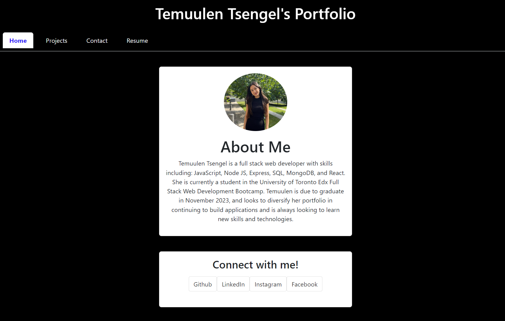
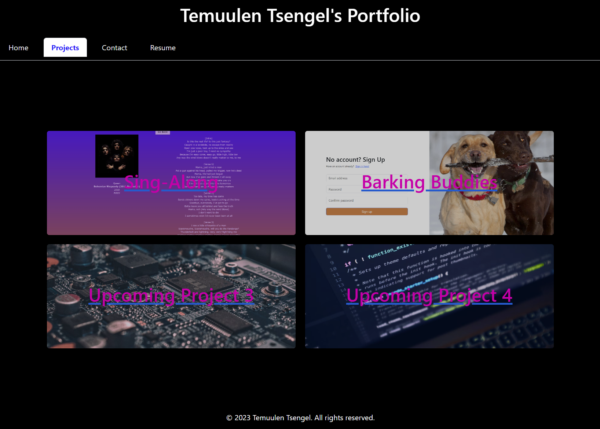
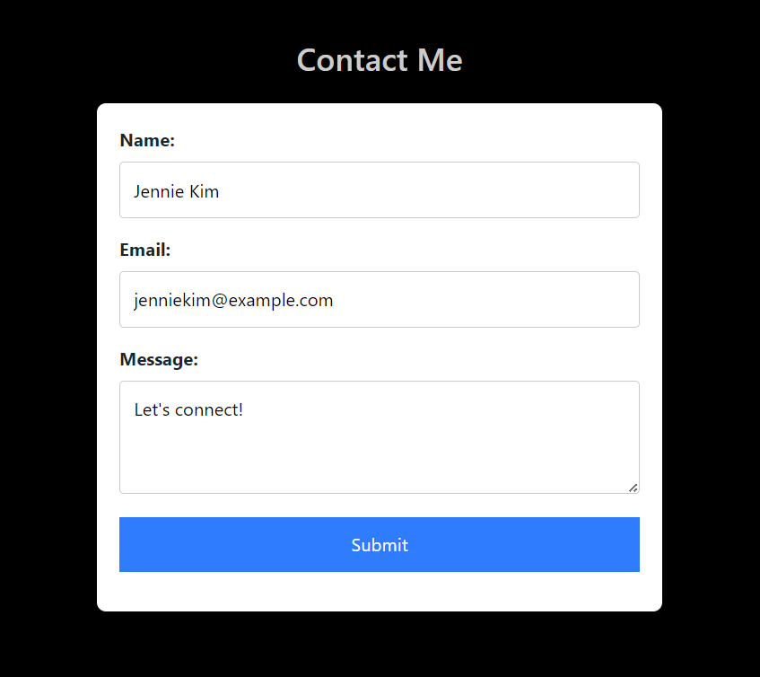
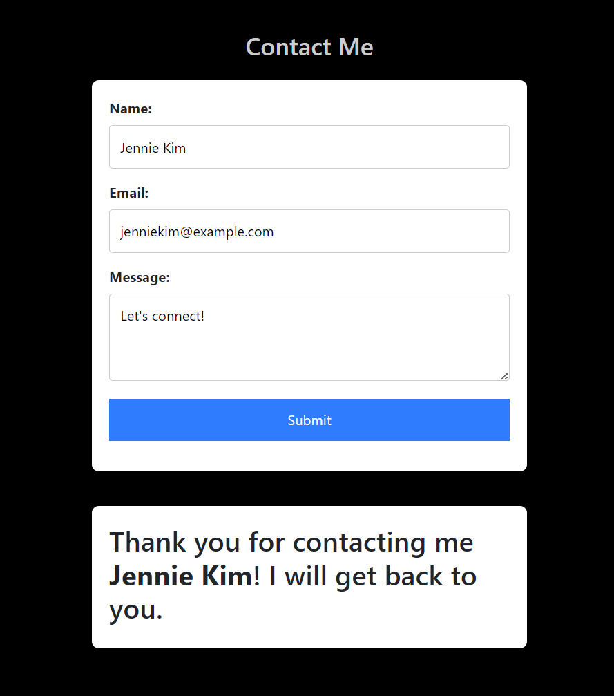
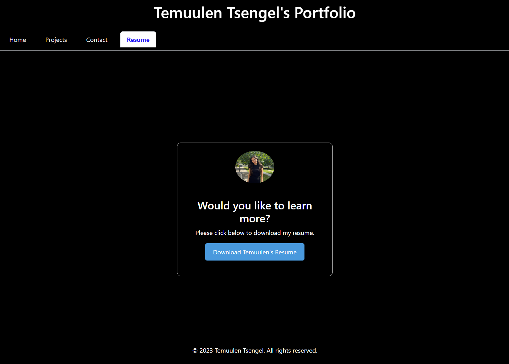

# Portfolio Built With React

This is a basic portfolio showcasing my projects. This was built with REACT.

## Table of Contents

- [Installation](#installation)
- [Usage](#usage)
- [License](#license)

## Installation

There is no installation required. Please visit the deployed page: https://amazing-mousse-9ed9b4.netlify.app/#resume

## Usage

There are 4 main pages to this application. 
1. Homepage - please see this page above that contains some information about me, and links that can allow users to find me on other social and professional platforms.
2. Projects - this page displays 2 of my completed projects, and 2 placeholders for my upcoming projects. Please click on the image of the top 2 projects to see previous works that I have contributed to! 

3. Contact Page - please fill out the text fields to get in touch with me! The interactive fields will ensure users are providing valid email addresses, and filling out mandatory fields. 

Once the user fills out the form, they will recieve a confirmation of their form submission pictured below: 

4. Resume Page - Please visit this page if you would like to learn more about me and my professional experience! When users click the blue Download Temuulen's Resume button, they will download my resume as a PDF to their local computer. 

## License
N/A

